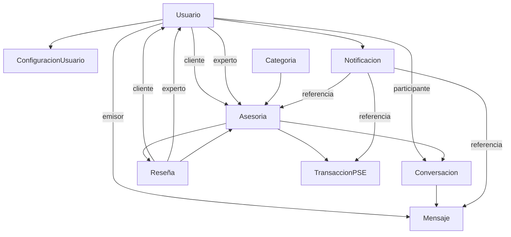

# 📊 MODELOS DE DATOS - SERVITECH

## 📋 Resumen de Implementación

Este documento detalla todos los modelos de datos implementados en ServiTech, incluyendo sus relaciones, campos principales y funcionalidades.

## 🗂️ Modelos Implementados

### 1. 📅 **Asesoría/Cita** (`asesoria.js`)
**Propósito**: Gestiona las reservas, horarios y estados de las asesorías.

#### Campos Principales:
- **Identificación**: `codigoAsesoria` único, participantes (`cliente`, `experto`)
- **Servicio**: `categoria`, `tipoServicio`, `titulo`, `descripcion`
- **Programación**: `fechaHora`, `duracion`, `zonaHoraria`
- **Pago**: `precio`, `metodoPago`, `transaccionPago`
- **Estado**: 10 estados diferentes desde `pendiente-pago` hasta `reembolsada`
- **Videollamada**: URLs, grabación, tiempos de inicio/fin
- **Seguimiento**: recordatorios, resultado, calificaciones

#### Estados del Flujo:
```
pendiente-pago → pagada → confirmada → en-curso → completada
              ↓
         cancelada-cliente/experto/no-show/reembolsada
```

#### Métodos Clave:
- `puedeSerCancelada()`: Verificar cancelación (2h antes)
- `tiempoRestante()`: Minutos hasta la asesoría
- `generarEnlaceVideollamada()`: Crear enlaces únicos
- `porUsuario()`: Buscar asesorías por rol
- `estadisticas()`: Métricas del dashboard

---

### 2. 💬 **Mensaje/Chat** (`mensaje.js`)
**Propósito**: Gestiona conversaciones entre usuarios y expertos.

#### Esquemas:
1. **Conversación**: Container de mensajes
2. **Mensaje**: Mensajes individuales

#### Conversación - Campos:
- **Identificación**: `codigoConversacion`, `participantes`
- **Relación**: `asesoria` (opcional)
- **Tipo**: `pre-asesoria`, `durante-asesoria`, `post-asesoria`, `soporte`
- **Estado**: `activa`, `pausada`, `cerrada`, `archivada`
- **Estadísticas**: `totalMensajes`, `ultimaActividad`

#### Mensaje - Campos:
- **Contenido**: `texto`, `tipo` (texto/imagen/archivo/video/audio)
- **Estado**: `enviando` → `enviado` → `entregado` → `leido`
- **Funciones**: respuestas, edición, eliminación soft
- **Lectura**: tracking por usuario con timestamps

#### Métodos Clave:
- `agregarParticipante()`: Unir usuario al chat
- `mensajesNoLeidos()`: Contador por usuario
- `marcarComoLeido()`: Estado de lectura
- `crearParaAsesoria()`: Chat automático para asesoría

---

### 3. 🔔 **Notificación** (`notificacion.js`)
**Propósito**: Sistema integral de notificaciones multi-canal.

#### Campos Principales:
- **Contenido**: `titulo`, `mensaje`, `descripcionCorta`
- **Tipos**: `asesoria`, `pago`, `mensaje`, `sistema`, `promocion`, etc.
- **Categorías**: `info`, `success`, `warning`, `error`, `urgent`
- **Referencias**: Enlaces a otros modelos con metadata

#### Canales de Entrega:
- **In-App**: Leído/no leído con timestamp
- **Email**: Integración con proveedor
- **SMS**: Mensajes de texto
- **Push**: Notificaciones móviles

#### Características Avanzadas:
- **Programación**: Envío diferido
- **Expiración**: Auto-expiración temporal
- **Acciones**: Botones/enlaces en notificaciones
- **Agrupación**: Notificaciones similares
- **Métricas**: Clicks, tiempo de lectura, dispositivo

#### Métodos Clave:
- `marcarComoLeida()`: Cambiar estado
- `crearNotificacionAsesoria()`: Templates predefinidos
- `crearNotificacionPago()`: Estados de pago
- `programadasPendientes()`: Cola de envío

---

### 4. ⭐ **Reseña/Calificación** (`reseña.js`)
**Propósito**: Sistema de valoraciones y comentarios detallado.

#### Calificaciones Detalladas:
- **General**: Promedio automático (1-5)
- **Específicas**: conocimiento, comunicación, puntualidad, solución problemas, calidad-precio

#### Comentarios:
- **Estructura**: `titulo`, `texto`, `aspectosPositivos`, `aspectosMejorar`
- **Recomendación**: Boolean de recomendación
- **Evidencias**: Imágenes, videos, documentos

#### Sistema de Moderación:
- **Estados**: `pendiente` → `aprobada`/`rechazada`/`oculta`/`reportada`
- **Análisis**: Sentimiento automático, palabras clave
- **Interacciones**: "Útil", reportes, respuestas de experto

#### Métricas y Analytics:
- **Estadísticas**: Promedios, distribución, recomendaciones
- **Tendencias**: Análisis temporal
- **Confianza**: Algoritmo de puntuación de calidad

#### Métodos Clave:
- `estadisticasExperto()`: Métricas completas por experto
- `calcularConfianza()`: Score de confiabilidad
- `analizarTendencias()`: Patrones temporales

---

### 5. ⚙️ **Configuración** (`configuracion.js`)
**Propósito**: Gestión de configuraciones del sistema y usuarios.

#### Esquemas:
1. **ConfiguracionSistema**: Settings globales
2. **ConfiguracionUsuario**: Preferencias personales

#### Configuración del Sistema:
- **Tipos**: `string`, `number`, `boolean`, `array`, `object`, `json`
- **Categorías**: `general`, `pagos`, `notificaciones`, `seguridad`, etc.
- **Validación**: Rangos, patrones, opciones válidas
- **Permisos**: Público/privado, solo lectura, requiere reinicio

#### Configuración de Usuario:
- **Notificaciones**: Email, push, SMS, in-app
- **Interfaz**: Tema, idioma, zona horaria, formatos
- **Calendario**: Vista, horarios, recordatorios
- **Videollamadas**: Cámara, micrófono, calidad
- **Privacidad**: Perfil público, estado en línea
- **Pagos**: Método predeterminado, facturas
- **Experto**: Disponibilidad, respuestas automáticas

#### Configuraciones Predeterminadas:
```javascript
app.nombre: "ServiTech"
app.version: "1.0.0"
pagos.comision_plataforma: 10
asesorias.duracion_maxima: 180
notificaciones.recordatorio_default: 30
```

#### Métodos Clave:
- `obtenerOCrear()`: Lazy loading de configuración
- `validarValor()`: Validación de reglas
- `crearConfiguracionesDefecto()`: Setup inicial

---

## 🔗 Relaciones Entre Modelos



## 📊 Características Técnicas

### Índices Optimizados
Todos los modelos incluyen índices específicos para:
- Consultas frecuentes por usuario
- Búsquedas por estado y fecha
- Relaciones entre modelos
- Búsquedas de texto

### Middleware Automatizado
- **Timestamps**: Automáticos en todos los modelos
- **Versioning**: Control de versiones
- **Estados**: Transiciones automáticas
- **Validaciones**: Reglas de negocio integradas

### Métodos Estáticos y de Instancia
- **Búsquedas**: Métodos específicos por contexto
- **Estadísticas**: Agregaciones MongoDB
- **Validaciones**: Lógica de negocio
- **Utilidades**: Helpers comunes

## 🚀 Próximos Pasos

### 1. Integración Backend
- [ ] Crear controladores para cada modelo
- [ ] Implementar rutas API REST
- [ ] Validaciones de entrada
- [ ] Middleware de autenticación

### 2. Frontend Integration
- [ ] Servicios API en JavaScript
- [ ] Componentes de UI
- [ ] Estados de aplicación
- [ ] Formularios y validaciones

### 3. Funcionalidades Avanzadas
- [ ] Websockets para chat en tiempo real
- [ ] Sistema de videollamadas
- [ ] Notificaciones push
- [ ] Analytics avanzados

### 4. Testing
- [ ] Tests unitarios por modelo
- [ ] Tests de integración
- [ ] Tests de performance
- [ ] Validación de datos

## 📝 Notas de Implementación

### Convenciones de Código
- **Esquemas**: PascalCase para nombres
- **Campos**: camelCase para propiedades
- **Métodos**: camelCase descriptivos
- **Constantes**: UPPER_CASE para enums

### Performance
- **Población**: Solo campos necesarios
- **Paginación**: Límites en consultas
- **Agregaciones**: Pipeline optimizado
- **Cacheo**: Redis para datos frecuentes

### Seguridad
- **Validación**: Mongoose + custom validators
- **Sanitización**: Prevención XSS/injection
- **Autorización**: Verificación de permisos
- **Auditoría**: Logs de cambios

---

✅ **Estado**: Modelos completamente implementados y validados
🎯 **Siguiente**: Implementación de controladores y rutas API
